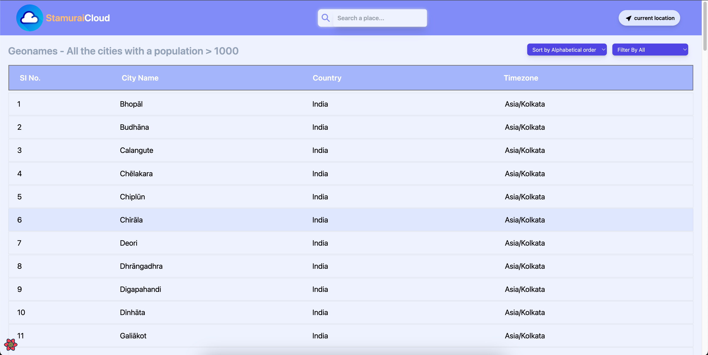
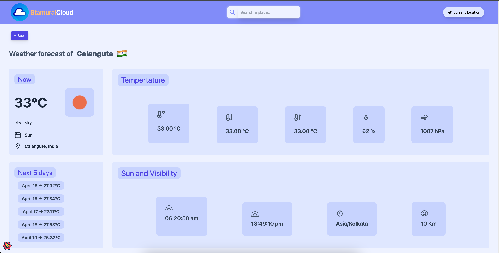
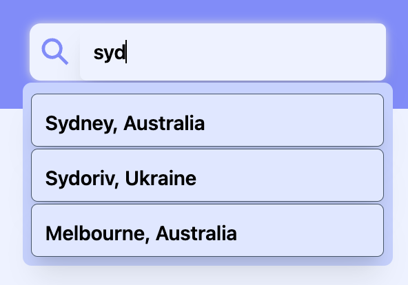
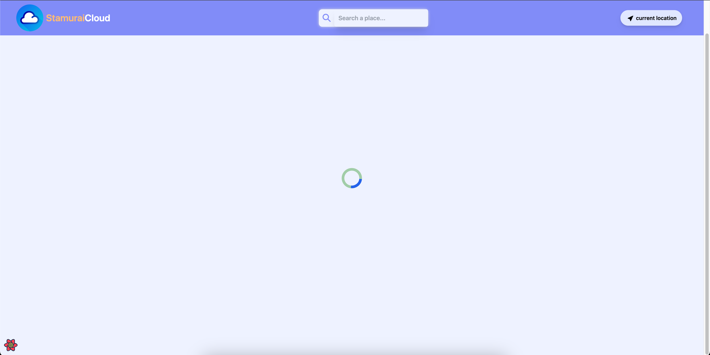

## Weather Application - Stamurai Assignment

# Weather Application Details:

- This weather application is built upon the requirements provided by the Stamurai an
  assignment for the Frontend Develper role.

- This Project is entirely built using JavScript library - React, along with some React Libraries and APIs.

# Libraries used in this Weather Application are listed below:

- React
- React Router
- React Query
- React Icons
- React-Hot-Toast
- React-loader-spinner

# APIS used in this Weather Applciayion are listed below:

- OpenWeather API
- OpenWeatherMap API
- Opendatasoft API
- wheretheiss API
- Geolocation API (built-in)

# Library Usage in Weather Application Project:

- **React** is the major library used for building this project.
- **React Router** is used for the routing and navigating to various urls of this project.
- **React Query** is used for handling and maintaining all the remote state of this project.
- **React Icons** is used for displaying relevent icons on the UI of this project.
- **React-Hot-Toast** is used or displaying the notification on the UI.
- **React-loader-spinner** is used for displaying the loaders while the data is being fetched from the APIs.

# APIs Usage in Weather Application Project:

- **OpenWeather API** is majorly used for fetching the weaather details of a particular city.
- **OpenWeatherMap API** is used for fetching the next 5 days of weather forecast for a particular city.
- **Opendatasoft API** is used for fetching the cities and its corresponding details.
- **wehretheiss API** is used for fetching the timezone of a particular city.
- **Geolocation API** is a built-in api of JavaScript, used for fetching the user's current location.

# Project Images

- Below are images showcasing various aspects of the project:
  
  This is initial homepage of the project, showing all the 100 cities fetched from the _opendatasodt_ api.

  
  This is Weather Page of the project, showing all the weather details of the selected city.

  
  This is the Search bar with suggestions and auto-complete feature, where users can search for city to get the weather details of the selected city in weather page.

  
  This is a button to fetch the current location of the user and redirect to the weather page to display the current location weather forecast.

  
  There are the buttons used for sorting and filtering the cities displayed

  
  This is how the loader is displayed when the weather details of the city is loading.
